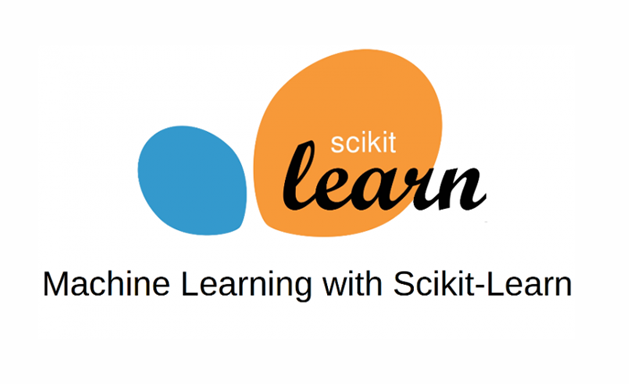

<!-- PROJECT LOGO -->
<br />
<div align="center">
  <a href="https://scikit-learn.org/stable/">
    
  </a>

  <h3 align="center">Curso Alura - Machine Learning: Introdução a classificação com SKLearn</h3>

</div>

<!-- ABOUT THE PROJECT -->
## Sobre o Curso

### 1. Introdução à classificação

[arquivo de script de introdução](intro.ipynb)

* LinearSVC

<div align="center">
    <div>
        
    </div>
    <div>
    <a href="https://scikit-learn.org/stable/modules/generated/sklearn.svm.LinearSVC.html">
        Veja a DOC do LinearSVC
    </a>
    </div>
</div>

   ```py
    from sklearn.svm import LinearSVC

    X = [[0, 0], [1, 1]]
    y = [0, 1]

    clf = LinearSVC(random_state=0)
    clf.fit(X, y)
   ```

* Acurácia

<div align="center">
    <div>
        
    </div>
    <div>
    <a href="https://scikit-learn.org/stable/modules/generated/sklearn.metrics.accuracy_score.html">
        Veja a DOC da Acurácia
    </a>
    </div>
</div>
   
   ```py
    from sklearn.metrics import accuracy_score

    y_pred = [0, 2, 1, 3]
    y_true = [0, 1, 2, 3]

    accuracy_score(y_true, y_pred)
   ```


### 2. Testes replicáveis, estratificação e lendo dados da internet

[arquivo de script de compra de carro](comprou.ipynb)

* Separação dos dados -> Treino e Teste

<div align="center">
    <div>
        
    </div>
    <div>
    <a href="https://scikit-learn.org/stable/modules/generated/sklearn.model_selection.train_test_split.html">
        Veja a DOC do Split de Treino e Teste
    </a>
    </div>
</div>

   ```py
    from sklearn.model_selection import train_test_split

    X_train, X_test, y_train, y_test = train_test_split(X, y, test_size=0.33, random_state=42)
   ```

o algorítimo train_test_split, por padrão, realiza aleatoriamente a separação de dados de treino e teste. Desse modo, todas as vezes que ele é executado podemos ter um resultado diferente.

```py
    SEED = 20

    treino_x, teste_x, treino_y, teste_y = train_test_split(x, y, random_state = SEED,  test_size=0.33)
```

o stratify = y, que irá estratificar os dados proporcionalmente de acordo com y

```py
    SEED = 20

    treino_x, teste_x, treino_y, teste_y = train_test_split(x, y,
                                                         random_state = SEED, test_size = 0.25,
                                                         stratify = y)
```


### 3. Um projeto de baixa dimensionalidade e o baseline

[arquivo de script de horas por preço de um projeto](hours_project_fineshed.ipynb)

* Visualização dos Dados -> Seaborn

<div align="center">
    <div>
        
    </div>
    <div>
    <a href="https://seaborn.pydata.org/generated/seaborn.scatterplot.html">
        Veja a DOC do Scatterplot do Seaborn
    </a>
    </div>
</div>
   
* Gráfico simples:

 

   ```py
    import seaborn as sns

    sns.scatterplot(x="horas_esperadas", y="preco", data=dados)

   ```

* Gráfico por cor:


   ```py
    import seaborn as sns

    sns.scatterplot(x="horas_esperadas", y="preco", data=dados)COPIAR CÓDIGO
   ```

* Gráfico separador por cor:

<div>
    <div>
        
    </div>
    <div>
    <a href="https://seaborn.pydata.org/examples/scatterplot_sizes.html">
        Veja a DOC do Relplot do Seaborn
    </a>
    </div>
</div>

   ```py
   sns.relplot(x="horas_esperadas", y="preco", hue="finalizado", col="finalizado", data=dados)
   ```

### 4. Support Vector Machine e a não linearidade

* SVM

<div align="center">
    <div>
        
    </div>
    <div>
    <a href="https://scikit-learn.org/stable/modules/svm.html#svm-classification">
        Veja a DOC do SVM
    </a>
    </div>
</div>

   ```py
    from sklearn import svm

    X = [[0, 0], [1, 1]]
    y = [0, 1]

    clf = svm.SVC()
    clf.fit(X, y)
   ```

* Escalador padrão do Sklearn

<div align="center">
    <div>
        
    </div>
    <div>
    <a href="https://scikit-learn.org/stable/modules/generated/sklearn.preprocessing.StandardScaler.html">
        Veja a DOC do StandardScaler
    </a>
    </div>
</div>

   ```py
    from sklearn.preprocessing import StandardScaler

    scaler = StandardScaler()
    scaler.fit(raw_treino_x)
    treino_x = scaler.transform(raw_treino_x)
    teste_x = scaler.transform(raw_teste_x)
   ```
Nesse caso retorna os dados de treino e teste na forma de um array numpy


### 5. Dummy classifiers e árvore de decisão

[arquivo de script de venda de carros](sell_car.ipynb)

* Dummy Classifier

<div align="center">
    <div>
        
    </div>
    <div>
    <a href="https://scikit-learn.org/stable/modules/generated/sklearn.dummy.DummyClassifier.html">
        Veja a DOC do DummyClassifier
    </a>
    </div>
</div>

   ```py
    from sklearn.dummy import DummyClassifier

    dummy_stratified = DummyClassifier()
    dummy_stratified.fit(treino_x, treino_y)
    acuracia = dummy_stratified.score(teste_x, teste_y) * 100

   ```


* Árvore de Decisão

<div align="center">
    <div>
        
    </div>
    <div>
    <a href="https://scikit-learn.org/stable/modules/generated/sklearn.tree.DecisionTreeClassifier.html">
        Veja a DOC do DecisionTreeClassifier
    </a>
    </div>
</div>

   ```py
    from sklearn.tree import DecisionTreeClassifier

    modelo = DecisionTreeClassifier(max_depth=3)
    modelo.fit(raw_treino_x, treino_y)
    previsoes = modelo.predict(raw_teste_x)

   ```

* Visualização da Árvore -> Graphviz

<div align="center">
    <div>
    <a href="https://scikit-learn.org/stable/modules/generated/sklearn.tree.export_graphviz.html">
        Veja a DOC do Graphviz
    </a>
    </div>
</div>

   ```py
    from sklearn.tree import export_graphviz
    import graphviz

    dot_data = export_graphviz(modelo, out_file=None,
                           filled = True, rounded = True,
                           feature_names = features,
                          class_names = ["não", "sim"])
    grafico = graphviz.Source(dot_data)
    grafico

   ```


